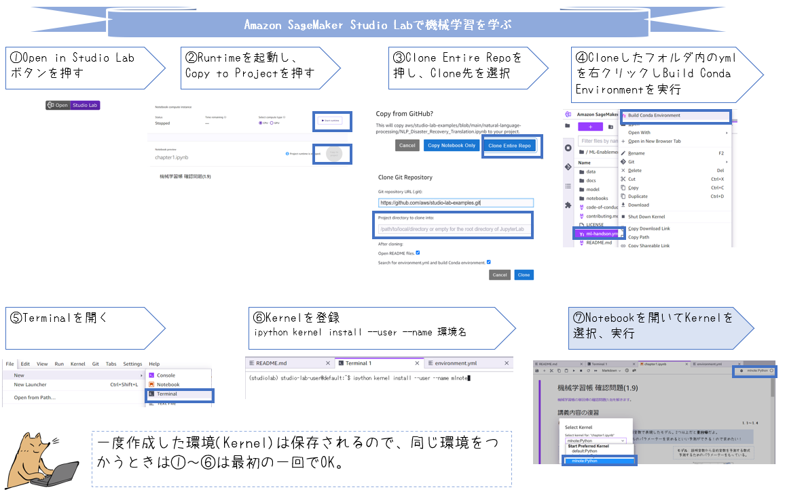

# mlnote-note

[機械学習帳](https://chokkan.github.io/mlnote/index.html)を学ぶノートです。下表の"Notebook"列のボタンを押すと解説、演習問題の実装例が参照できます(詳しくは"Notebookの実行"のセクションを参照してください)。

| Chapter | Notebook |
|----------|-----|
| [1.単回帰](https://chokkan.github.io/mlnote/regression/01sra.html) | [](https://studiolab.sagemaker.aws/import/github/icoxfog417/mlnote-note/blob/main/notebooks/chapter1.ipynb) |
| [2.重回帰](https://chokkan.github.io/mlnote/regression/02mra.html) | [](https://studiolab.sagemaker.aws/import/github/icoxfog417/mlnote-note/blob/main/notebooks/chapter2.ipynb) |
| [3.モデル選択と正則化](https://chokkan.github.io/mlnote/regression/02mra.html) | [](https://studiolab.sagemaker.aws/import/github/icoxfog417/mlnote-note/blob/main/notebooks/chapter3.ipynb) |

## Notebookの実行

Notebookを実行するには、依存ライブラリのインストールが必要です。

### Amazon SageMaker Studio Lab

Amazon SageMaker Studio Labはメールアドレスのみで利用できるJupyterLab環境です。[使い方は"Amazon SageMaker Studio Lab の使い方"を参照してください](https://github.com/aws-studiolab-jp/awesome-studio-lab-jp/blob/main/README_usage.md)。

次の手順に沿いボタン/メニューを押していくことで環境構築ができます。一度作成した環境は保存されるため、⑦以外の手順は最初の1回のみでOKです。



⑥のカーネルの登録は次のコマンドで行います。このコマンドを実行すると、Notebookを開いたとき右上のボタンから`mlnote`のKernelが選択できるようになります。作成したKernelを選択していないとライブラリが足りないよ～というメッセージが出るので注意してください。

```
conda activate mlnote
ipython kernel install --user --name mlnote
```

### ローカル環境

上記の④の代わりにターミナルから`conda env create --file environment.yml`を実行してください。以後の手順は同じです。
